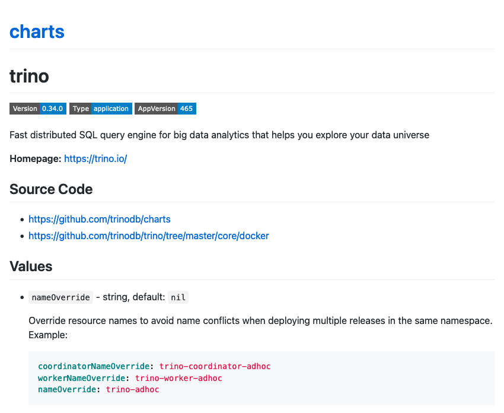

### Trino Community Helm Chart

https://github.com/trinodb/charts.git

<div style="font-size: 20px;">

```shell
helm repo add trino https://trinodb.github.io/charts/
helm install my-trino trino/trino --version 0.34.0
```

</div>

-vertical

### Documentation

https://trinodb.github.io/charts/

  <!-- .element width="80%" style="float: none; background-color: white; border: 5px solid white;" title="Chart documentation" -->

-vertical

### Development guidelines

1. Does it work correctly?
1. Is it robust?
1. Is it easy to use?

-notes
Trino configuration can be quite complex, and it is important that the Helm
Chart does not simply end up adding another layer of complexity.

Automated testing is an important aspect to consider when developing new
features for the Helm Chart, since it is the only way to ensure correctness
even in edge cases.

-vertical

### Test framework

1. Make changes with confidence
1. Test every Pull Request
1. Test locally
1. Test end to end

-notes
When adding new features or fixing bugs, make sure not to impact existing
functionality, and preserve backward compatibility.

This helped clearing the PR queue.

Test by deploying on a real Kubernetes cluster, with properly configured Trino, execute a query, and assert results.

Tests are layered. Use `chart-testing` for running tests in Kubernetes, so it works with any cluster.
Use `kind` to make it easy to test locally. Run `test.sh` to deploy all dependencies.


-vertical

### Test suites

1. Defaults
1. Single node
1. Complete values
1. Multiple releases in a single namespace
1. Access control
1. Exchange manager
1. Graceful shutdown
1. Resource groups

-notes

There are multiple tests with different `values.yaml`. Add more tests when necessary, balance overhead with coverage.

Some of these tests are run on multiple Trino versions.
