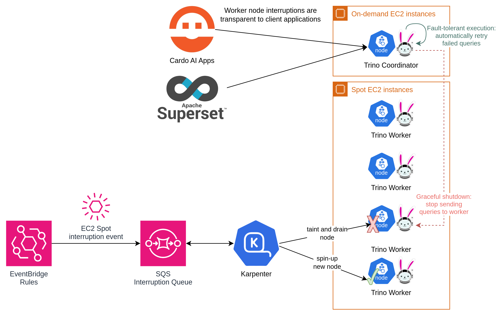
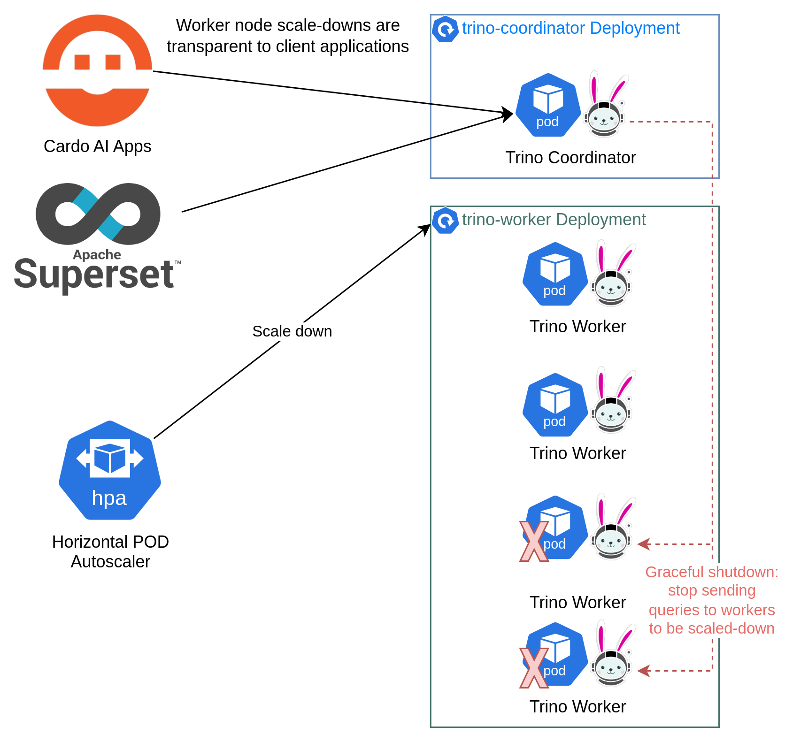

### Worker graceful shutdown
* Trino has a graceful shutdown API that can be used on workers in order to ensure that they terminate without affecting running queries, given a sufficient grace period.
* Once the API is called, the worker performs the following steps:
    1. Go into `SHUTTING_DOWN` state.
    2. Sleep for `shutdown.grace-period`. After this, the coordinator is aware of the shutdown and stops sending tasks to the worker.
    3. Block until all active tasks are complete.
    4. Sleep for the grace period again in order to ensure the coordinator sees all tasks are complete.
    5. Shutdown the application.

-vertical

### Enable worker graceful shutdown
##### If enabled, the worker graceful shutdown configuration will:
* Add a preStop lifecycle event to all worker Pods;
* Configures the `shutdown.grace-period` property;
* Configure the workers' `accessControl` since the default system access control does not allow graceful shutdowns;
* Validate the `worker.terminationGracePeriodSeconds` value (which must be at least 2 &times; `shutdown.grace-period`);
* Ensure that `worker.lifecycle` is not set.

-vertical

#### Cost-effective deployment with worker graceful shutdown

  <!-- .element width="80%" style="float: none; background-color: white; border: 5px solid white;" title="Trino Spot Workers" -->

-vertical

#### Autoscaling with worker graceful shutdown

  <!-- .element width="60%" style="float: none; background-color: white; border: 5px solid white;" title="Trino HPA Workers" -->

-vertical

### Testing worker graceful shutdown
To test the correctness of the feature the following test was created:
1. A `kubectl` container tails the worker Pod's logs and looks for the "Shutdown requested" message.
2. Another `kubectl` container deletes the worker Pod triggering the `pre-stop` lifecycle hook. 

-vertical

### Testing worker graceful shutdown

<div style="font-size: 20px;">


```yaml
# test-graceful-shutdown.yaml
apiVersion: v1
kind: Pod
...
  containers:
    - name: check-logs
      image: bitnami/kubectl:latest
      command: [ "sh", "-c" ]
      args:
        - >-
          WORKER_POD=$(cat /pods/worker-pod.txt) &&
          kubectl logs ${WORKER_POD}
          --follow
          --container=trino-worker
          --namespace={{ .Release.Namespace }}
          | grep --max-count=1 "Shutdown requested"
...
    - name: trigger-graceful-shutdown
      image: bitnami/kubectl:latest
      command: [ "sh", "-c" ]
      args:
        - >-
          sleep 5 &&
          WORKER_POD=$(cat /pods/worker-pod.txt) &&
          kubectl delete pod
          ${WORKER_POD}
          --namespace={{ .Release.Namespace }}
...
```

</div>
