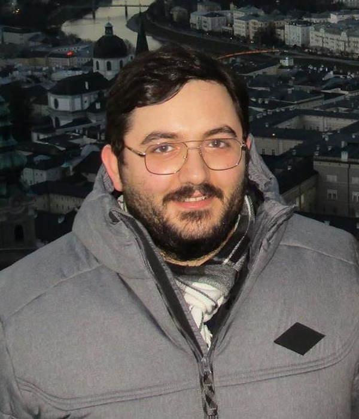

### Optimizing Trino on Kubernetes:
##### Helm Chart Enhancements for Resilience and Security
  <!-- .element width="40%" style="float: none;" title="Trino Summit logo" -->

###### December 11 - 12, 2024

| Speakers:           |           |
|---------------------|-----------|
| Sebastian Daberdaku | Cardo AI  |
| Jan Wa&sacute;      | Starburst |

-vertical

## About the speakers
  <!-- .element width="15%" style="float: none;" title="Sebastian Daberdaku" -->

### Sebastian Daberdaku

Data Engineering Tech Lead

  <!-- .element width="40%" style="float: none;" title="Cardo AI Logo" -->

-notes 
I am currently the Data Engineering Tech Lead of Cardo AI, a global structured finance-focused Fintech, whose technology has facilitated the efficient management of over $40bn assets, integrating and standardizing data from 100+ sources. 

My expertise lies in building and managing data platform infrastructures with technologies such as TrinoDB, Spark, Airflow, Databricks, and the related cloud architecture with Terraform. 

-vertical
  <!-- .element width="15%" style="float: none;" title="Jan Wa&sacute;" -->

### Jan Wa&sacute;

Software Engineer

  <!-- .element width="40%" style="float: none;" title="Starburst Logo" -->
