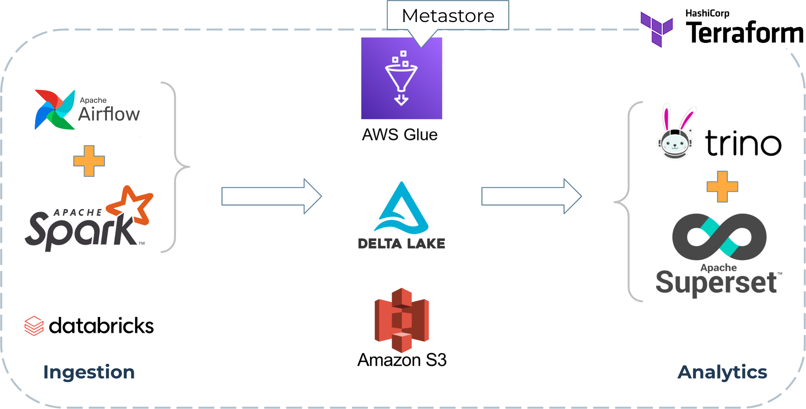

### Lakehouse tech-stack @ Cardo AI
  <!-- .element width="100%" style="float: none; background-color: white; border: 10px solid white;" title="Lakehouse" -->

-notes

Let us now have a look at the Lakehouse implementation that we built at Cardo AI.

We are currently using Delta Lake on top of AWS S3, with AWS Glue as metastore. 

We manage our data ingestion workflows with Apache Airflow pipelines powered by Spark or with databricks, and build our analytics on top of the Delta Lake using TrinoDB and Apache Superset. 

All these components are managed through Terraform. 

We use Terraform to manage S3 buckets, Glue Databases, Airflow deployments, Databricks workspaces and clusters, IAM policies and roles, and also TrinoDB credentials.

-vertical

### Trino usage @ Cardo AI

* We have been using Trino in production since 2022;
* Mostly short-lived, real-time queries;
* Initially deployed on AWS EKS with custom (forked) Helm Chart;
* Many of the presented features were developed in our fork of the Chart;
* Frequent Chart updates required to keep-up with the fast-paced Trino releases;
* Finally decided to "donate" these features to the official Chart.

-notes

At Cardo AI, we are running a Trino cluster on AWS EKS which is mainly used by our structured finance SaaS suite for running analytical queries on pre-aggregated data. The queries are generally short-lived, and used in real time to populate our frontend applications.

Many of the presented features were first developed in our fork of the official chart I had made some time ago. 
but it was becoming a pain keeping the chart up to date with the new versions of trino so I thought it would be best to "donate" these changes and make it easier to upgrade.
