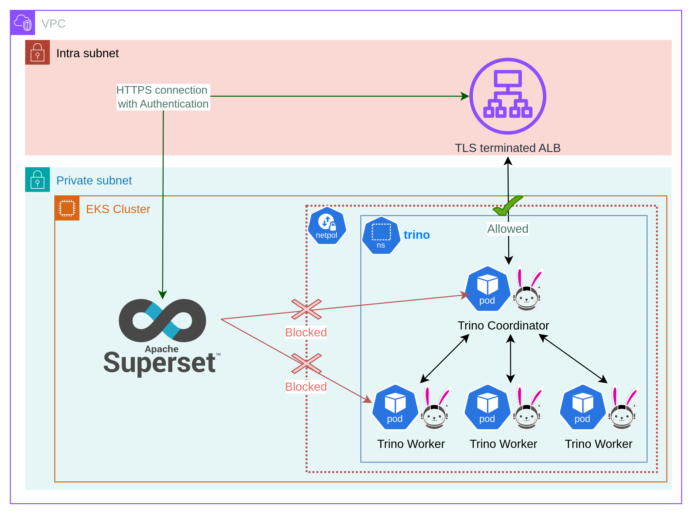

### `NetworkPolicy` protection

* Trino supports multiple authentication types to ensure all users of the system are authenticated. Different authenticators allow user management in one or more systems.
* All authentication requires secure connections using TLS and HTTPS or process forwarding enabled.
* To configure Trino with TLS there are two alternatives:
    1. **Use a TLS-terminated Load Balancer or proxy (preferred)**;
    2. Secure Trino directly with valid a TLS certificate (must manage certificates, increased CPU usage).

-vertical

### `NetworkPolicy` protection
* To prevent unauthorized connections to Trino from within the Kubernetes cluster, a `NetworkPolicy` can be used.
* On EKS requires VPC CNI Plugin.
* Can be used to only allow ingress traffic to Trino from Pods with certain labels or from given CIDR blocks.

-vertical

##### TLS-terminated ALB with `NetworkPolicy` protection

  <!-- .element width="70%" style="float: none; background-color: white; border: 5px solid white;" title="Trino NetworkPolicy" -->

-vertical

### Testing `NetworkPolicy` protection
Connections from unauthorized Pods will time-out.

<div style="font-size: 25px;">

```yaml
# test-networkpolicy.yaml
apiVersion: v1
kind: Pod
...
  containers:
    - name: check-connection
      image: {{ include "trino.image" . }}
      command: [ "/bin/bash", "-c" ]
      args:
        - >-
          curl
          {{ include "trino.fullname" . }}.{{ .Release.Namespace }}:{{ .Values.service.port }}
          --head
          --fail
          --connect-timeout 10
          --max-time 10
          2>&1 | grep -q "timed out"
...
```
</div>